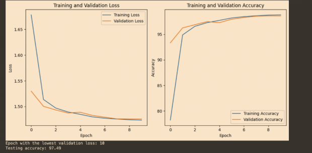

# Part 9 (final architecture)

Final multi-layer core architecture: PIC front-end (Conv2d with sum-pooling, batch norm, mish activation, Kaiming init, 28x28 MNIST -> 6x13x13 feature maps) feeding into a 3-layer core stack (4 cores each, 256 in/256 out) and a final pooled/softmax output layer. Iterates on training schedule (cosine annealing LR, early stopping) on top of the fixed architecture from earlier parts.

**Notebook (final iteration):** [Part9_Code.ipynb](Part9_Code.ipynb) ([open in Colab](https://colab.research.google.com/drive/1qa7tjwCh_VfIiQiT346Xh4jfgMr__gy2))

## Results

| Step | LR | Train Acc | Val Acc | Test Acc | Notes |
|---|---|---|---|---|---|
| 9a | 0.0001 | 98.8 | 98.56 | 97.49 | |
| 9a + Cosine Annealing LR (start=0.0001, T_max=20, min=0.00001) | 0.0001 | 99.59 | 99.38 | **97.92** | 200 epochs, early stopping, stopped at epoch 41 |

Best result: **97.92% test accuracy**, with cosine-annealed LR and early stopping.

*(Table and graph sourced from the lab's "Part 9 Results" tracking spreadsheet, which also embeds a graph and a direct Colab link per experiment row - the full sheet has additional rows beyond what's summarized here.)*

## All notebooks in this part

- [Part9a_03-1-25](https://colab.research.google.com/drive/1qJx-Y6Auy0y6t-z_SLwWbqju-m2tiBDA)
- [Part9b_03-8-25](https://colab.research.google.com/drive/1lm3q9DxXHjhgKCBfl4_ApnKPb_yHq_ug)
- [Part9ca_03-8-25](https://colab.research.google.com/drive/10o8t8XDP-gkkOBK79kjpxbrBxcjMldre)
- [Part9da_03-8-25](https://drive.google.com/file/d/1--NtnoJAuGsamA_vJe7OG52pQ_1puWxh/view)
- [Part9ea_03-16-25](https://drive.google.com/file/d/1p-U2Zl6ylR7ZPRDc5RdzcWCbEc7dJ-1R/view)
- [Part9ec_03-19-25 (final)](https://colab.research.google.com/drive/1qa7tjwCh_VfIiQiT346Xh4jfgMr__gy2) (linked above)

*(Links were bulk-extracted from Drive and read back via screenshot, since Drive doesn't expose per-file share links as plain text - a couple of characters in look-alike ID segments, e.g. `I`/`l`/`1`, may need a spot-check before you rely on them.)*
